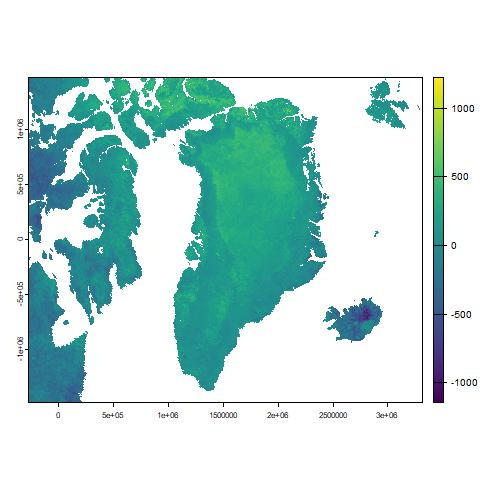

# Analisi multitemporali in R
Importazione di un immagine da:

``` r
im.list() # faccio una lista
gr = im.import("greenland") # per importare l'immagine
```

Calcoliamo la differenza di valore di due immagini

``` r
grdif = gr[[4]]- gr[[1]]
```

Questo va a creare l'immagine di output seguente:


