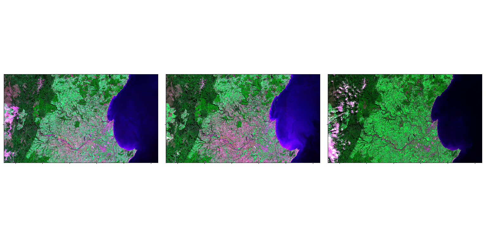
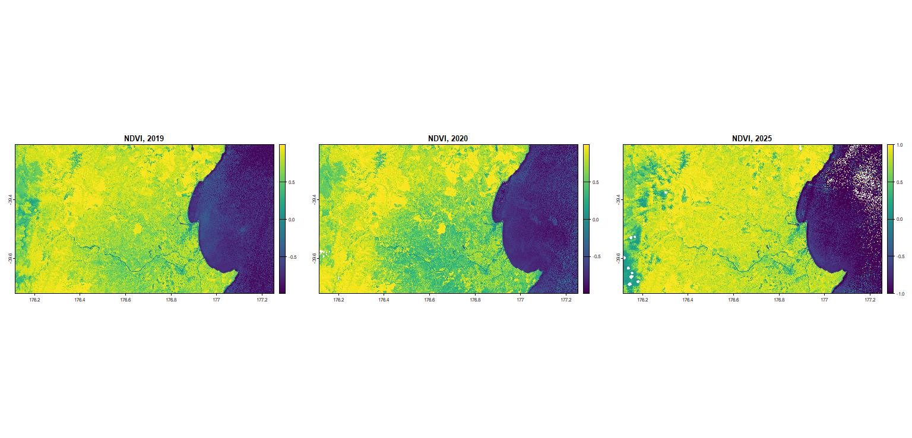
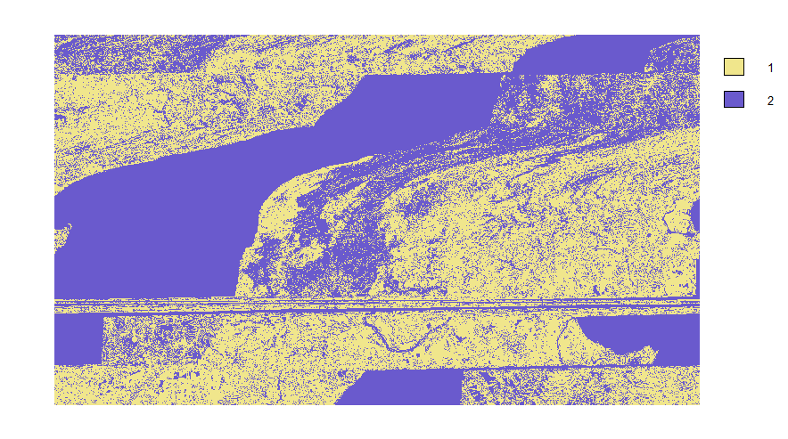
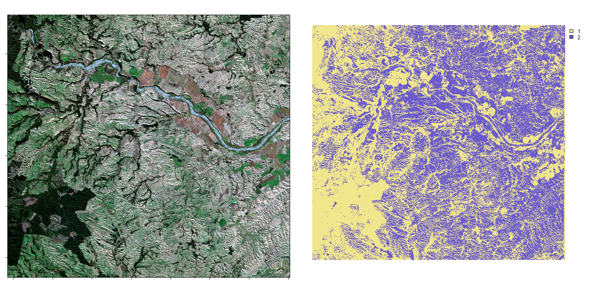

# **Esame telerilevamento geo-ecologico in R (09/07/2025)**
## Nuova Zelanda: la siccità della costa est nel 2020 
Francesca Novelli

## Introduzione
L'area di interesse del progetto è la Nuova Zelanda, in particolare la costa est dell'isola Nord: lo scopo è quello di confrontare e analizzare le immagini dell'anno 2020, in cui l'area di interesse è stata colpita da una forte siccità, con le immagini degli anni del 2019, cioè l'anno pre-siccità, e del 2025, cioè lo stato attuale. 

Le immagini utilizzate sono prese dal satellite Sentinel-2 e sono una mediana del periodo dal 1° al 31 maggio dei rispettivi anni (2019, 2020 e 2025). 

## Raccolta Dati
I dati sono stati presi dal seguente sito: [Google Earth Engine](https://earthengine.google.com/)

Il codice utilizzato per scaricare le immagini è il seguente: [Cartella codice GEE](https://github.com/francescanovelli/Telerilevamento2025/blob/main/esame/GEE.js)

## Pacchetti utilizzati:
``` r
library(terra) # Manipola dati geografici (spaziali) in formato "raster" e "vettore"
library(imageRy) # Pacchetto per la visualizzazione di immagini raster su R
library(viridis) # Cambia la palette di colori sulle immagini raster
```
Inserisco la directory
``` r
setwd("C:/Users/User/OneDrive/Documenti/UNI/TELERILEVAMENTO")
```

## Importazione delle immagini
Importo le immagini dell'area interessata dalla siccità e le visualizzo nello spettro del visibile 
``` r
Area_19 <- rast("Area19.tif")
Area_20 <- rast("Area20.tif")
Area_25 <- rast("Area25.tif")
 
im.multiframe(1,3) 
plotRGB(Area_19, r=1, g=2, b=3, stretch= "lin", main= "Sentilenl-2, Mag. 2019")
plotRGB(Area_20, r=1, g=2, b=3, stretch= "lin", main= "Sentilenl-2, Mag. 2020")
plotRGB(Area_25, r=1, g=2, b=3, stretch= "lin", main= "Sentilenl-2, Mag. 2025")
```


> Le tre immagini riprendono l'area della costa est dell'isola Nord della Nuova Zelanda; nell'immagine centrale del 2020 si vede chiaramente l'impatto della siccità

---
Per l'analisi dati successiva ho scelto di selezionare un'area più piccola che corrisponde alla zona più colpita dalla siccità. Importo quindi le altre tre immagini e visualizzo le 4 bande selezionate per ogni immagine: B4 (red), B3 (green), B2 (blue) e B8 (NIR). 

``` r
Sentinel_NZ19 <- rast("NZ_NIR19.tif")
plot(Sentinel_NZ19, main=c("B4","B3","B2","B8"), col= cividis(100))
``` 


``` r
Sentinel_NZ20 <- rast("NZ_NIR20.tif")
plot(Sentinel_NZ20, main=c("B4","B3","B2","B8"),  col= cividis(100))
```


``` r
Sentinel_NZ25 <- rast("NZ_NIR25.tif")
plot(Sentinel_NZ25, main=c("B4","B3","B2","B8"),  col= cividis(100))
```


> Avendo scaricato le immagini dal satiellite Sentinel-2, che acquisisce immagini per bande, i file che restituisce sono in formato .tif e sono suddivisi in bande. Per ottenere un'immagine con colori reali è quindi necessario combinare le varie bande.
>
> Sono state selezionate le quattro bande elencate prima perchè: le bande B4, B3 e B2 servono per la visualizzazione in RGB, mentre la banda B8 serve per valutare la salute della vegetazione, in quanto le piante sane assorbono la luce visibile e riflettono il NIR, mentre le piante stressate o malate riflettono meno NIR e assorbono più luce visibile. A prova di ciò la banda B8 del 2020 presenta valori più bassi di riflettanza rispetto a quelle del 2019 e 2025 nell'area interessata da siccità.

---

Visualizzo le immagini in RGB dell'area di studio
``` r
im.multiframe(1,3) 
plotRGB(Sentinel_NZ19, r=1, g=2, b=3, stretch= "lin", main= "Sentilenl-2, Mag. 2019")
plotRGB(Sentinel_NZ20, r=1, g=2, b=3, stretch= "lin", main= "Sentilenl-2, Mag. 2020")
plotRGB(Sentinel_NZ25, r=1, g=2, b=3, stretch= "lin", main= "Sentilenl-2, Mag. 2025")
```


## Banda del NIR
Per evidenziare la differenza tra suolo nudo e vegetazione ho inserito la banda B8 (NIR) al posto della banda B3 (green). 

``` r
im.multiframe(1,3)
im.plotRGB(Sentinel_NZ19, r=1, g=4, b=2)
im.plotRGB(Sentinel_NZ20, r=1, g=4, b=2)
im.plotRGB(Sentinel_NZ25, r=1, g=4, b=2)
```

Le immagini sono nel seguente ordine a partire da sinistra: 2019, 2020 e 2025.

 

> Nell'immagine si può osservare il suolo nudo in rosa e la vegetazione in verde, dove sfumature diverse corrispondono a vegetazioni diverse. Come ci attendiamo dalle premesse, l'immagine del 2020 risulta quella con maggior porzione di suolo nudo.
> La vegetazione appare verde in quanto la banda del NIR è stata posizionata al posto della banda verde


## NDVI, Normalized Difference Vegetation Index

L'NDVI è un indice che sfrutta il diverso comportamento della vegetazione nella riflessione nel rosso e nel NIR per valutare la presenza e lo stato di salute della vegetazione. Si tratta di un indice che va da -1 a +1 perchè è normalizzato, quindi svincolato dalla risoluzione dell'immagine.
+ +1 indica lo stato di massima salute della vegetazione
+ 0 indica la presenza di suolo nudo o assenza di vegetazione
+ -1 indica la presenza di acqua, neve, o altri elementi che non riflettono la luce nello stesso modo della vegetazione

La formula per calcolarlo è la seguente:      $` NDVI = \frac{(NIR - Red)}{(NIR + Red)} `$


``` r
ndvi19= im.ndvi(Sentinel_NZ19, 4, 1)
ndvi20= im.ndvi(Sentinel_NZ20, 4, 1)
ndvi25= im.ndvi(Sentinel_NZ25, 4, 1)

im.multiframe(1,3)
plot(ndvi19, col=viridis(100), main= "NDVI, 2019")
plot(ndvi20, col=viridis(100), main= "NDVI, 2020")
plot(ndvi25, col=viridis(100), main= "NDVI, 2025")
```



> Come ci aspettiamo da quanto detto precedentemente, l'immagine del 2020 presenta dei valori vicino allo zero nell'area colpita da siccità.

## Calcolo della differenza tra NDVI dell'anno 2020 e dell'anno 2025
Calcolando la differenza tra NDVI dell'anno 2020 e dell'anno 2025 ho informazioni su come la copertura vegetale sia variata tra le due situazioni: questa differenza indica se la vegetazione è aumentata (differenza negativa) o diminuita (differenza positiva). 

```r
ndvidif= ndvi20 - ndvi25
plot(ndvidif, col=viridis(100), main="Differenza NDVI '20-'25")
```


## Classificazione
La funzione di R `im.classify()` permette di classificare i pixel di un'immagine in cluster, in questo caso 2.

```r
cl20= im.classify(Sentinel_NZ20, num_cluster=2)
```



>[!WARNING]
>
> Come possiamo vedere dall'immagine risultante la classificazione non è riuscita per due fattori: la funzione di R opera una classificazione non supervisionata e l'immagine rappresenta un'area molto vasta ed eterogenea. Di conseguenza le soluzioni a questo problema sono o utilizzare un'area più piccola o utilizzare una classificazione supervisionata.

A dimostrazione di ciò ho scaricato un'ulteriore immagine da GEE di un'area molto più ristretta sempre rappresentante l'area colpita da siccità nel 2020 e l'ho sottoposta a classificazione

```r
Sentinel_NZ= rast("NZ_areaclass.tif")

im.multiframe(1,2)
im.plotRGB(Sentinel_NZ, r=1, g=2, b=3)
clnz= im.classify(Sentinel_NZ, num_clusters=2)
```



> La classificazione dell'area ha prodotto un'immagine in due colori, in giallo (Classe 1) la vegetazione e in viola (Classe 2) tutto il resto. 

## Conclusioni 
- Dall'analisi delle immagini possiamo concludere che la vegetazione dal 2019 al 2020 è diminuita notevolmente, permettendo di individuare facilmente le zone colpite dalla siccità. Nonostante questo però la vegetazione nel 2025 appare nettamente in ripresa, anche rispetto alla situazione pre-impatto del 2019. 
- Per quanto riguarda la classificazione si potrebbe ottenere un risultato più accurato effettuando una classificazione supervisionata con selezione manuale dei pixel suddividendoli nei vari cluster. 
