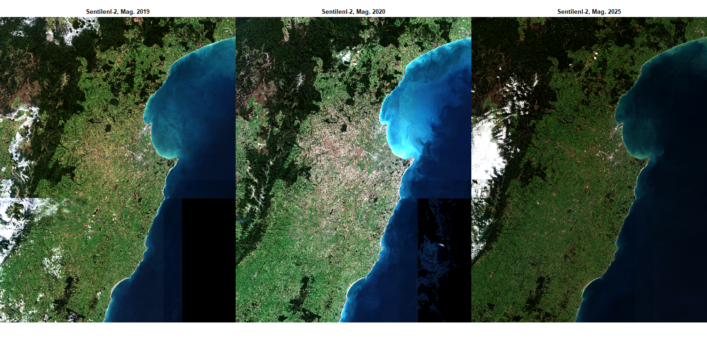
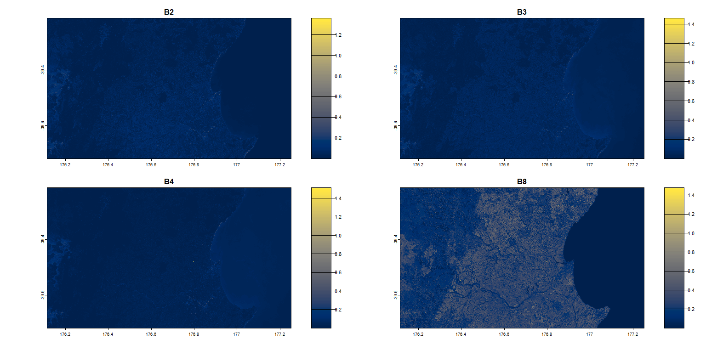
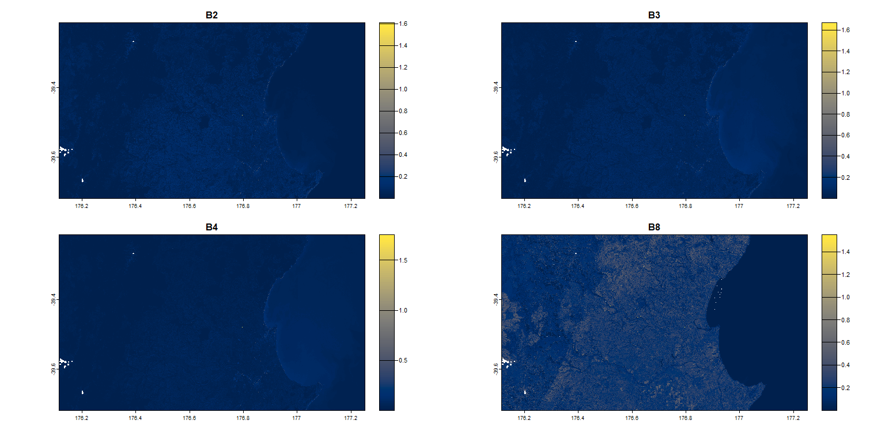
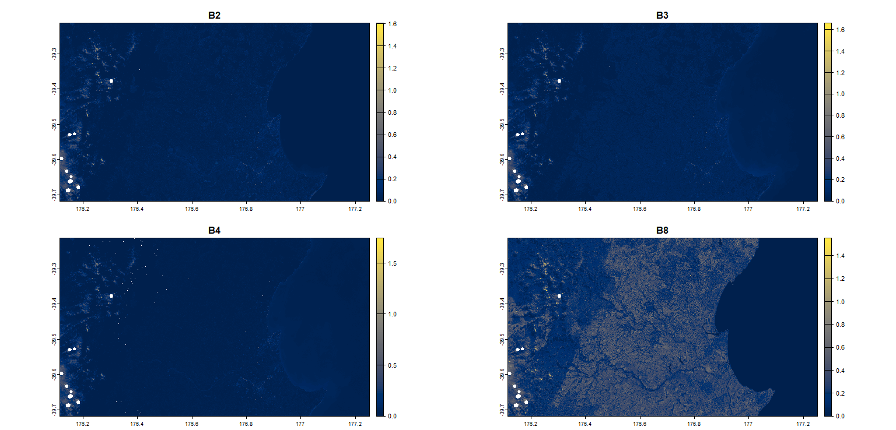
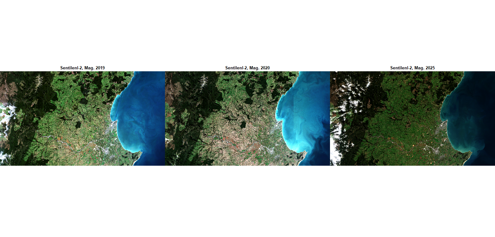

# **Esame telerilevamento geologico in R (09/07/2025)**
## Nuova Zelanda, La siccità della costa est nel 2020 e confonto prima e dopo 
Francesca Novelli

## Introduzione
L'area di interesse del progetto è la Nuova Zelanda, in particolare la costa est dell'isola Nord: lo scopo è quello di confrontare l'anno 2020, in cui l'area di interesse è stata colpita da una forte siccità, con gli anni del 2019,cioè l'anno pre-siccità, e del 2025, cioè lo stato attuale. 

Le immagini utilizzate sono una mediana del preiodo dal 1° al 31 maggio dei ripettivi anni (2019, 2020 e 2025). 

## Raccolta Dati
I dati sono stati presi dal seguente sito: [Google Earth Engine](https://earthengine.google.com/)

Il codice utilizzato per scaricare le immagini è il seguente: [Cartella codice GEE](https://github.com/francescanovelli/Telerilevamento2025/blob/main/esame/GEE.js)

## Pacchetti utilizzati:
``` r
library(terra) # Manipola dati geografici (spaziali) in formato "raster" e "vettore"
library(imageRy) # Pacchetto per la visualizzazione di immagini raster su R
library(viridis) # Cambia la palette di colori sulle immagini raster
```
Inserisco la directory
``` r
setwd("C:/Users/User/OneDrive/Documenti/UNI/TELERILEVAMENTO")
```

## Importazione delle immagini
Importo le immagini dell'area interessata dalla siccità e le visualizzo nello spettro del visibile 
``` r
Area_19 <- rast("Area19.tif")
Area_20 <- rast("Area20.tif")
Area_25 <- rast("Area25.tif")
 
im.multiframe(1,3) 
plotRGB(Area_19, r=1, g=2, b=3, stretch= "lin", main= "Sentilenl-2, Mag. 2019")
plotRGB(Area_20, r=1, g=2, b=3, stretch= "lin", main= "Sentilenl-2, Mag. 2020")
plotRGB(Area_25, r=1, g=2, b=3, stretch= "lin", main= "Sentilenl-2, Mag. 2025")
```


> Le tre immagini riprendono l'area della costa est dell'isola Nord della Nuova Zelanda; nell'immagine centrale del 2020 si vede chiaramente l'impatto della siccità

---
Per l'analisi dati successiva ho scelto di selezionare un'area più piccola che corrisponde alla zona più colpita dalla siccità. Importo quindi le altre tre immagini e visualizzo le 4 bande selezionate per ogni immagine: B4 (red), B3 (green), B2 (blue) e B8 (NIR). 

``` r
Sentinel_NZ19 <- rast("NZ_NIR19.tif")
plot(Sentinel_NZ19, main=c("B2","B3","B4","B8"), col= cividis(100))
``` 


``` r
Sentinel_NZ20 <- rast("NZ_NIR20.tif")
plot(Sentinel_NZ20, main=c("B2","B3","B4","B8"),  col= cividis(100))
```



``` r
Sentinel_NZ25 <- rast("NZ_NIR25.tif")
plot(Sentinel_NZ25, main=c("B2","B3","B4","B8"),  col= cividis(100))
``` 


> Avenndo scaricato le immagini dal satiellite Sentinel-2, che acquisisce immagini per bande, i file che restituisce sono in formato .tif e sono suddivisi in bande. Per ottenre un'immagine con colori reali è quindi necessario combinare le varie bande.
>
> Sono state selezionate le quattro bande elencate prima perchè: le bande B4, B3 e B2 servono per la visualizzazione in RGB, mentre la banda B8 serve per valutare la salute della vegetazione, in quanto le piante sane assorbono la luce visibile e riflettono il NIR, mentre le piante stressate o malate riflettono meno NIR e assorbono più luce visibile. A prova di ciò la banda B8 del 2020 presenta valori più bassi di riflettanza ripetto a quelle del 2019 e 2025 nell'area interessata da siccità.

---

Visualizzo le immagini in RGB dell'area di studio
``` r
im.multiframe(1,3) 
plotRGB(Sentinel_NZ19, r=1, g=2, b=3, stretch= "lin", main= "Sentilenl-2, Mag. 2019")
plotRGB(Sentinel_NZ20, r=1, g=2, b=3, stretch= "lin", main= "Sentilenl-2, Mag. 2020")
plotRGB(Sentinel_NZ25, r=1, g=2, b=3, stretch= "lin", main= "Sentilenl-2, Mag. 2025")
```


